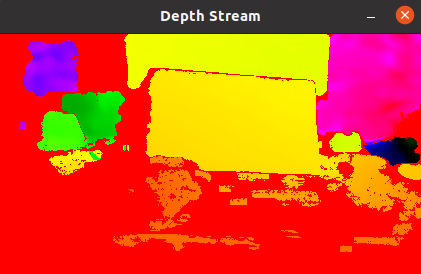
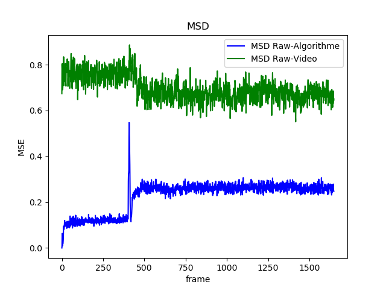

# intelligent-storage and comparation

This is a project developed to compress depth data frames from the camera IntelRealSense D455.

The program convert depth data into three representations : 

* Raw Data -> ./ output.v{*last version*} / raw_data /
* Sparse matrix -> ./ output.v{*last version*} / algo /
* RGB Video -> ./ output.v{*last version*} / video /

To launch compression : 

```
python3 launch_stream.py
```

Once the data is stored, the reliability of the representations can be analysed. To compare it, the mean squared error with the *raw-sparse data* and *raw-video data* is calculated. 

To launch comparation : 

```
python3 launch_comparator.py [directory : optional]
```

To highlight, directory must to have the structure described above in order to have a good operation of the programme. In the case that directory is not specified, the programme will search the last *output* directory.


## Output stream 


## MSD
